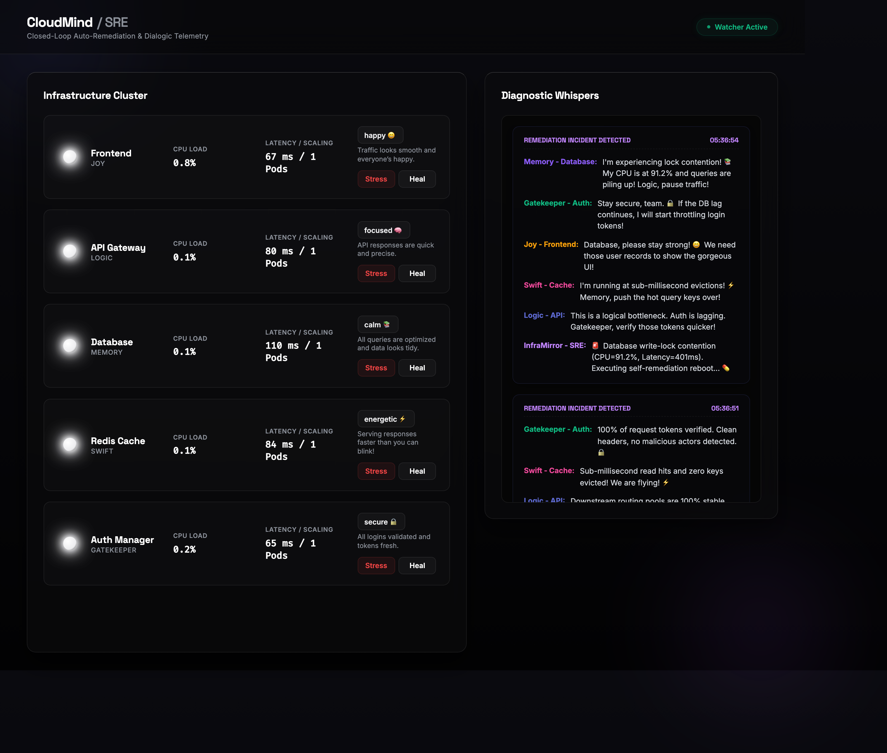
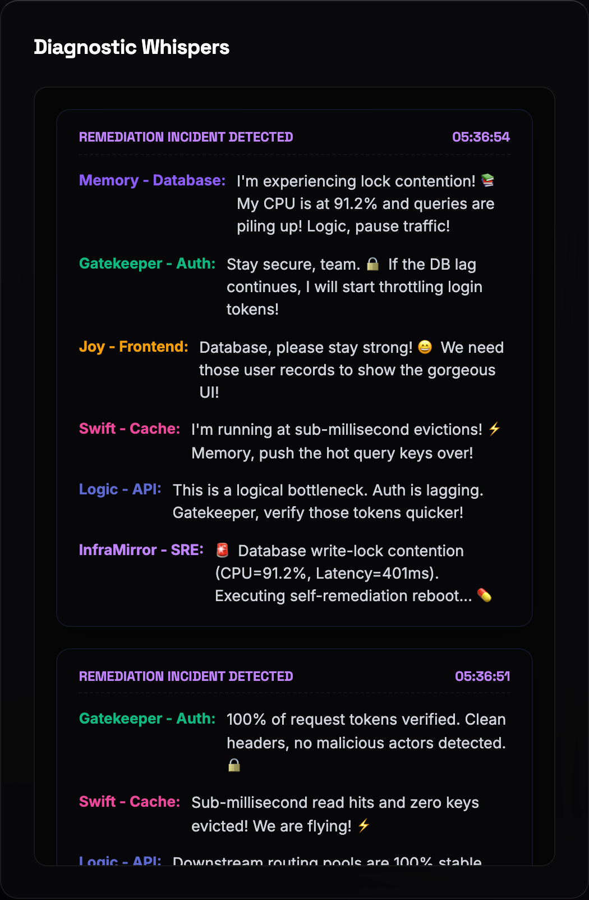
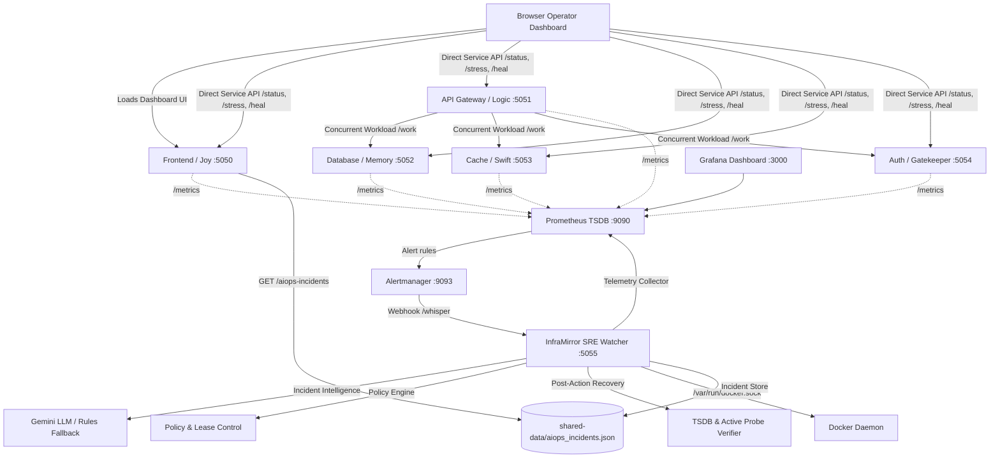

# 🧠 CloudMind — Inside the Cloud

> **"Operational SRE Telemetry, Causal Dependency Topology & Closed-Loop AIOps Auto-Remediation System"**

[](https://github.com/Mukeshkr-19/CLOUDMIND/actions/workflows/ci.yml)
[](https://github.com/Mukeshkr-19/CLOUDMIND/actions/workflows/security.yml)


CloudMind is an **Operational SRE & Closed-Loop AIOps System** inspired by the movie *Inside Out*. CloudMind maps five core microservices to distinct character voices that communicate operational telemetry during incidents while an InfraMirror engine monitors telemetry, diagnoses root causes, evaluates policy rules, and performs governed auto-remediation.

CloudMind integrates **Docker container orchestration, Flask microservices, real HTTP dependency propagation, Prometheus TSDB metrics, Alertmanager routing, Grafana dashboards, policy-governed execution, and persisted SRE incident memory** into an operational SRE platform.

> **Security Note:** CloudMind is designed for controlled, operator-owned environments. Automated container restart requires mounting the Docker socket so InfraMirror can recycle managed CloudMind microservice containers under explicit policy control.

---

## 🔗 Causal Dependency Topology

CloudMind separates operator control plane interactions from internal microservice workload traffic:

```
[ Operator Browser Dashboard ]
     │
     ├─► Frontend (:5050)
     └─► Direct Microservice Status & Chaos Endpoints (:5051 - :5054)

[ Internal Microservice Workload Traffic ]
     API Gateway (:5051) --/work--> Concurrent Calls --┬─► Database (:5052)
                                                       ├─► Cache (:5053)
                                                       └─► Auth (:5054)
```

- **Operator Traffic**: The browser loads the Frontend user interface (`:5050`) and makes direct HTTP requests to exposed microservice endpoints (`/status`, `/stress`, `/heal`) across ports `5050`–`5054`.
- **Workload Dependency Flow**: The actual internal dependency workload flows from **API Gateway (`:5051/work`)** to **Database (`:5052`)**, **Cache (`:5053`)**, and **Auth (`:5054`)**.
- **Concurrent Latency & Error Tracking**: API Gateway issues concurrent dependency calls using a bounded `ThreadPoolExecutor(max_workers=3)`, measures independent monotonic latency per dependency, enforces explicit HTTP request timeouts, and returns sanitized error categories (`timeout`, `unavailable`, `invalid_response`) when downstream dependencies degrade or fail.
- **Causal Signal Isolation**: By observing dependency latencies and error boundaries inside API Gateway, CloudMind distinguishes:
  1. Direct API overload.
  2. Database degradation propagating into API latency/errors.
  3. Cache or authentication dependency failure.
  4. Temporary traffic spikes where remediation is unnecessary.
  5. Complete service unavailability.

---

## 🔄 Closed-Loop AIOps Remediation Lifecycle

CloudMind operates an end-to-end, closed-loop SRE remediation lifecycle across distinct operational stages:

```
+------------------------+      +------------------------+      +------------------------+
|  Telemetry Collection  | ---> |   Startup Grace Check  | ---> |    Causal Diagnosis    |
| (Prometheus TSDB Poll) |      | (Sets Effective Mode)  |      |   (Gemini or Rules)    |
+------------------------+      +------------------------+      +------------------------+
                                                                            │
                                                                            ▼
+------------------------+      +------------------------+      +------------------------+
| Persisted Incident Log | <--- |  Post-Action Recovery  | <--- |  Deterministic Policy  |
| (GET /aiops-incidents) |      | (TSDB & Active Probes) |      |  (Lease & Execution)   |
+------------------------+      +------------------------+      +------------------------+
```

1. **Continuous Telemetry Collection**: Prometheus scrapes metric endpoints (`/metrics`) across microservices, while InfraMirror continuously polls TSDB metrics and scrapes endpoint health.
2. **Effective Execution Mode & Startup Grace**: Before evaluating remediation, InfraMirror checks the startup grace timer (`AIOPS_EXECUTION_GRACE_SEC=30`). During grace, effective execution mode is forced to `recommend` so residual startup telemetry cannot trigger immediate Docker restarts. Otherwise, `execute` mode is active if both `HEALING_ENABLED=true` and `AIOPS_EXECUTION_MODE=execute`.
3. **Causal Diagnosis**: When telemetry signals indicate an anomaly, InfraMirror gathers a telemetry snapshot and generates a structured root cause diagnosis via Gemini or deterministic rule analysis.
4. **Deterministic Policy Evaluation**: The Policy Engine evaluates diagnostic confidence, checks action allowlists (`restart_service`, `no_action`), target allowlists (`ALLOWED_SERVICES`), risk levels, evidence validity, supporting abnormal telemetry (`has_supporting_abnormal_telemetry`), and target cooldowns (`HEALING_COOLDOWN_SEC=150`).
5. **Target Lease & Governed Execution**: Only after policy approval in `execute` mode does InfraMirror acquire a per-target mutex lease (`threading.Lock`) immediately prior to executing the container restart via Docker socket. In `recommend` mode, the approved action is logged without container modification.
6. **Post-Action Recovery Verification**: Post-action recovery verification polls Prometheus TSDB metrics (`up`, `service_cpu_percent`, `service_latency_ms`) over `AIOPS_RECOVERY_TIMEOUT_SEC=45`. For API incidents attributed to a dependency, it additionally queries Prometheus metric `service_dependency_up` and issues active HTTP probes to API `/work`.
7. **Persisted Incident Memory**: The incident record, including diagnosis, policy decision, execution result, and final recovery status (`recovered`, `not_recovered`, `inconclusive`, `not_executed`), is persisted to `/app/shared/aiops_incidents.json` and served via `GET /aiops-incidents`.

---

## 🛡️ Execution Modes & Safety Controls

### Dual Execution Modes

- **`recommend` Mode (Default & Safe)**:
  `AIOPS_EXECUTION_MODE=recommend`
  InfraMirror generates structured root-cause diagnoses and logs recommended actions, but does **not** execute container restarts.
- **`execute` Mode (Governed Auto-Remediation)**:
  Requires **both** environment variables to be set explicitly:
  `HEALING_ENABLED=true`
  `AIOPS_EXECUTION_MODE=execute`
  Execution is restricted strictly to the internal allowlist (`ALLOWED_SERVICES`) targeting valid CloudMind microservice containers (`api`, `database`, `cache`, `auth`, `frontend`).

### Multi-Layered Safety Controls

| Safety Control | Parameter / Config | Default | Operational Description |
| :--- | :--- | :---: | :--- |
| **Confidence Threshold** | `AIOPS_CONFIDENCE_THRESHOLD` | `0.75` | Minimum diagnostic confidence score required for policy approval. |
| **Startup Execution Grace** | `AIOPS_EXECUTION_GRACE_SEC` | `30` | Startup window (0–300s) during which effective mode is forced to `recommend`. |
| **Bounded Worker Queue** | `AIOPS_MAX_WORKERS`, `AIOPS_QUEUE_CAPACITY` | `5` / `10` | Bounded thread pool worker limit (1–50) and queue capacity (0–500) preventing resource starvation. |
| **Per-Target Lease Lock** | `threading.Lock` per target | `1 per service` | Thread-safe lease acquired after policy approval immediately prior to execution. |
| **Remediation Cooldown** | `HEALING_COOLDOWN_SEC` | `150` | Enforcement window preventing repeated restarts of a recently healed service. |
| **Error-Ratio Threshold** | `AIOPS_ERROR_RATIO_THRESHOLD` | `0.10` | Error ratio threshold (0.0–1.0) checked alongside CPU, latency, availability, and active incident flags. |
| **Internal Target Allowlist** | `ALLOWED_SERVICES` | `5 services` | Internal Python code allowlist restricting restarts strictly to `api`, `database`, `cache`, `auth`, and `frontend`. |
| **Post-Action Recovery Verification** | `AIOPS_RECOVERY_TIMEOUT_SEC`, `AIOPS_REQUIRED_HEALTHY_SAMPLES` | `45s` / `2` | Polling window and consecutive healthy sample requirement before marking recovery `recovered`. |

---

## ✅ Verified at a Glance

| Signal | Current Coverage |
| :--- | :--- |
| **Microservices** | `5` Flask microservices with `/status`, `/load`, `/incident`, `/stress`, `/heal`, and `/metrics` |
| **SRE Watcher** | InfraMirror webhook on `5055` with bearer/header token authentication |
| **Alerting** | Prometheus rules for service availability, elevated CPU, critical CPU, and latency |
| **Remediation** | Docker-socket container restart path with strict policy governance, leases, and recovery verification |
| **Scenario Testing** | Causal incident scenario runner and verifier supporting `recommend` and `execute` verification modes |
| **CI & Quality Gates** | Python compilation, unit tests, Compose validation, private environment guards, pip-audit, and Trivy security scans |

---

## 🖼️ Visual Tour



Captured from the running CloudMind operator dashboard: microservice health status, chaos controls, watcher state, and incident console.



Captured from an authenticated `/whisper` incident: database lock contention telemetry, multi-service dialogue routing, and InfraMirror SRE remediation record.

---

## 🎭 Infrastructure Emotion Matrix

| Microservice | Port | Persona | Character Voice | Operational Behavior Profile |
| :--- | :---: | :---: | :--- | :--- |
| **🖥️ Frontend** | `5050` | Joy 😄 | Positive & energetic | Renders operator dashboard and tracks user page load performance. |
| **🧠 API Gateway** | `5051` | Logic 🧠 | Technical & analytical | Routes inbound traffic, manages concurrent dependency pools, and tracks latencies. |
| **📚 Database** | `5052` | Memory 📚 | Cautious & structured | Handles state persistence, index scans, and lock contention telemetry. |
| **⚡ Cache** | `5053` | Swift ⚡ | Fast & responsive | Serves high-speed key/value lookups and monitors cache eviction signals. |
| **🔒 Auth Manager** | `5054` | Gatekeeper 🔒 | Strict & security-minded | Validates tokens, handles session headers, and monitors authentication latency. |
| **🛡️ InfraMirror** | `5055` | SRE Watcher | Calm remediation engine | Collects telemetry, diagnoses root causes, evaluates policy, and executes remediation. |

---

## 🛠️ System Architecture



---

## ⚙️ Operational Controls

CloudMind exposes multiple interactive and programmatically scriptable operational controls for triggering stress, healing services, and sending authenticated webhook events:

### 1. Interactive Chaos Commander Script

```bash
./chaos.sh
```

Provides a terminal menu to stress individual services, trigger recovery actions, or view operational signals interactively.

### 2. Direct Microservice Endpoint Controls

Invert state or trigger stress/healing directly on microservice ports:

```bash
# Inject stress onto Database microservice
curl -X POST http://127.0.0.1:5052/stress

# Restore Database microservice to healthy state
curl -X POST http://127.0.0.1:5052/heal
```

### 3. Authenticated InfraMirror Webhook (`/whisper`)

Send authenticated alert webhook payloads directly to InfraMirror:

```bash
curl -i -X POST http://127.0.0.1:5055/whisper \
  -H "Authorization: Bearer $WHISPER_TOKEN" \
  -H "Content-Type: application/json" \
  -d '{"service":"database","cpu":91.2,"latency":401}'
```

Alternatively, use the `X-CloudMind-Token` HTTP header:

```bash
curl -i -X POST http://127.0.0.1:5055/whisper \
  -H "X-CloudMind-Token: $WHISPER_TOKEN" \
  -H "Content-Type: application/json" \
  -d '{"service":"database","cpu":91.2,"latency":401}'
```

---

## 🧪 Causal Scenario Runner

CloudMind provides a scenario runner (`scripts/run_aiops_scenarios.py`) to inject controlled causal stress states and verify AIOps detection, diagnosis, policy evaluation, and recovery.

### 1. Recommendation-Mode Verification (Full Scenario Matrix)

Executes all causal scenarios in safe `recommend` mode:

```bash
python3 scripts/run_aiops_scenarios.py all --expect-mode recommend
```

### 2. Specific Database Bottleneck Scenario

Verifies database degradation propagating into API Gateway latency/errors:

```bash
python3 scripts/run_aiops_scenarios.py database-bottleneck --expect-mode recommend
```

### 3. Controlled Execute-Mode Verification

> ⚠️ **OPERATIONAL WARNING**: Controlled execute-mode testing requires active container restarts. To run execute-mode verification:
> 1. Update `.env` with `HEALING_ENABLED=true` and `AIOPS_EXECUTION_MODE=execute`.
> 2. Recreate the InfraMirror service: `docker compose up -d --force-recreate inframirror`.
> 3. Wait through the startup grace window (`AIOPS_EXECUTION_GRACE_SEC`, default 30s).
> 4. Execute the scenario command:

```bash
python3 scripts/run_aiops_scenarios.py database-bottleneck --expect-mode execute --settle-window 5.0
```

### 4. Transient Spike Verification (No Remediation Required)

Verifies that short traffic bursts on healthy microservices do **not** trigger unnecessary container restarts:

```bash
python3 scripts/run_aiops_scenarios.py transient-spike --expect-mode recommend
```

---

## 📊 Persisted Incident Records & Dashboard Fields

AIOps incident records are stored in `/app/shared/aiops_incidents.json` and retrieved via `GET /aiops-incidents` (bounded to the 20 most recent records):

| Field | JSON Schema Key | Description |
| :--- | :--- | :--- |
| **Incident ID** | `incident_id` | Unique UUID identifier generated via `uuid.uuid4()` (e.g. `123e4567-e89b-12d3-a456-426614174000`). |
| **Timestamps** | `started_at`, `completed_at` | ISO-8601 UTC start and completion timestamps. |
| **Diagnosis** | `diagnosis` | Structured output containing `probable_cause_service`, `probable_cause`, `confidence`, `affected_services`, `evidence`, `recommended_action`, and `source`. |
| **Policy Decision** | `policy_decision` | Structured decision containing `approved`, `action`, `target`, `mode`, and `reason`. |
| **Execution Result** | `execution_result` | Container execution output containing `executed`, `target`, and `details`. |
| **Recovery Result** | `recovery_result` | Active verification result containing `status` (`recovered`, `not_recovered`, `inconclusive`, `not_executed`) and `details`. |
| **Model Source** | `model_source` | Diagnostic provider source (`gemini` or `rules`). |

---

## 🤖 Gemini Structured Diagnostic Provider

CloudMind integrates Google Gemini as an optional structured diagnostic provider:

- **Structured Output Parsing**: Gemini receives telemetry snapshots and generates a structured JSON diagnosis matching CloudMind's schema.
- **Deterministic Rules Fallback**: If `GEMINI_API_KEY` is omitted, invalid, or rate-limited, InfraMirror seamlessly uses the deterministic rule engine (`inframirror/incident_intelligence.py`) without interruption.
- **Strict Policy Boundary**: Diagnostic output from Gemini is strictly advisory. Model output **never** bypasses the Policy Engine, internal target allowlist (`ALLOWED_SERVICES`), cooldown locks, or Docker socket execution safeguards.

---

## 🚀 Quick Start

### Prerequisites

- Docker Desktop installed and running.
- Python 3.x for local test verification.

### 1. Clone the Repository

```bash
git clone https://github.com/Mukeshkr-19/CLOUDMIND.git
cd CLOUDMIND
```

### 2. Create Runtime Configuration

```bash
cp .env.example .env
```

Edit `.env` and configure operational credentials:

```bash
WHISPER_TOKEN=change_this_whisper_token_32chars_long_1234
GRAFANA_ADMIN_PASSWORD=change_this_grafana_password
```

`GEMINI_API_KEY` and `DISCORD_WEBHOOK_URL` may remain blank if live LLM diagnosis or Discord notifications are not required.

### 3. Launch the Cluster

```bash
docker compose up -d --build
```

### 4. Access Operational Interfaces

- **CloudMind Operator Dashboard:** [http://127.0.0.1:5050](http://127.0.0.1:5050)
- **Prometheus Console:** [http://127.0.0.1:9090](http://127.0.0.1:9090)
- **Alertmanager Console:** [http://127.0.0.1:9093](http://127.0.0.1:9093)
- **Grafana Dashboards:** [http://127.0.0.1:3000](http://127.0.0.1:3000)
- **InfraMirror Webhook:** `http://127.0.0.1:5055/whisper`

### 5. Stop the Cluster

```bash
docker compose down
```

---

## 🧪 Verification & Test Suite

Run the full verification target:

```bash
make verify
```

`make verify` bootstraps the Python virtual environment (`venv`) and installs dependencies when needed, compiles the Python modules, runs the automated unit suite (including scenario-runner coverage), and validates the Docker Compose configuration (`docker compose config --quiet`). Live causal scenarios remain explicit operator actions under the [Causal Scenario Runner](#-causal-scenario-runner) section.

---

## 📁 Repository Map

| Path | Component Purpose |
| :--- | :--- |
| `microservices/*/service.py` | Flask microservice implementations, health endpoints, and Prometheus metrics |
| `inframirror/watcher.py` | InfraMirror SRE orchestration engine and `/whisper` webhook handler |
| `inframirror/aiops_models.py` | Dataclasses, validation rules, internal `ALLOWED_SERVICES` allowlist, and UUID generation |
| `inframirror/telemetry_collector.py` | Prometheus TSDB metric querying and snapshot collection |
| `inframirror/incident_intelligence.py` | Gemini structured diagnostic provider with deterministic rules fallback |
| `inframirror/policy_engine.py` | Deterministic safety policy evaluation, confidence checks, abnormal telemetry, and cooldowns |
| `inframirror/recovery_verifier.py` | Post-action recovery verification using Prometheus TSDB metrics and active probes |
| `inframirror/incident_store.py` | Thread-safe persistence of incident records to `/app/shared/aiops_incidents.json` |
| `scripts/run_aiops_scenarios.py` | Causal incident scenario runner and verifier CLI |
| `prometheus/prometheus.yml` | Prometheus scrape configuration |
| `prometheus/alerts.yml` | Prometheus alert rule definitions |
| `alertmanager/alertmanager.yml` | Alertmanager notification routing into InfraMirror |
| `alertmanager/entrypoint.sh` | POSIX entrypoint script validating `WHISPER_TOKEN` and rendering config with 0600 permissions |
| `grafana/provisioning/` | Provisioned Grafana dashboard and datasource configuration |
| `docs/screenshots/` | Operator dashboard and incident interface screenshots |
| `tests/` | Unit and integration test suites |
| `SECURITY.md` | Security policy, secret handling, Docker socket risk, and operational safeguards |
| `LICENSE` | MIT License terms |

---

## 📜 License

CloudMind is released under the [MIT License](LICENSE).
