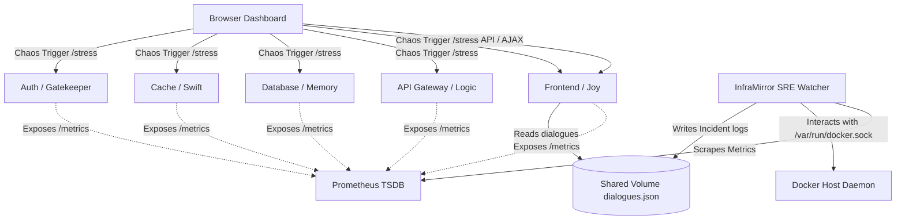

# 🧠 CloudMind — Inside the Cloud

> **"What if your cloud infrastructure could talk in character to tell the story of a system outage?"**

CloudMind is a highly creative, production-grade **Dialogic Telemetry & Closed-Loop SRE Auto-Remediation platform** inspired by the movie *Inside Out*. Instead of engineers scrolling through dry, overwhelming alerts, CloudMind maps key microservices to distinct emotional characters who actively discuss system incidents in real time, and leverages an automated SRE engine to heal them.

This project is a comprehensive full-stack systems engineering showcase proving capabilities in **container orchestration, time-series metrics collection, closed-loop automation, shared volume state management, and custom telemetry dashboard designs.**

---

## 🎭 The Infrastructure Emotion Matrix

| Microservice | Emotion | Character Voice | Behavior Profile |
| :--- | :---: | :---: | :--- |
| **🖥️ Frontend** | Joy 😄 | Positive & Energetic | Hates lag, strives for perfect sub-100ms response rates. |
| **🧠 API Gateway** | Logic 🧠 | Technical & Impatient | Easily frustrated by downstream database delays. |
| **📚 Database** | Memory 📚 | Cautious & Nervous | Panics under heavy write locks or high indexing loads. |
| **⚡ Redis Cache** | Swift ⚡ | Hyper-Active & Fast | Evicts keys at lightning speed, gets exhausted under high misses. |
| **🔒 Auth Manager** | Gatekeeper 🔒 | Snarky & Sarcastic | Highly paranoid, rejects requests under token verification spikes. |

---

## 🛠️ System Architecture

CloudMind runs as an orchestrated multi-container cluster inside a local Docker network:



1. **The Core Microservices (`microservices/`):** Five lightweight Flask APIs tracking local CPU metrics and response latencies using `psutil`.
2. **Observability Database (`prometheus/`):** A Prometheus TSDB polling `/metrics` from all containers every 5 seconds.
3. **The SRE AI Whisperer (`inframirror/`):** An independent watcher container that mounts `/var/run/docker.sock` and a shared Docker Volume (`shared-data`).
4. **Interactive Dashboard:** A custom-coded glassmorphic UI served by the Frontend on port `5050` displaying live metrics, animated LED health dots, a simulated scaling module, and a real-time log of the Inside-Cloud conversations.

---

## 🚀 SRE Core Concepts Demonstrated

### 1. Auto-Remediation (Self-Healing) vs. Horizontal Scaling
A key architectural principle in SRE is recognizing when to **Scale Out** versus when to **Remediate (Reboot)**:
* **Horizontal Scaling (HPA):** If a service experiences high legitimate user traffic, scaling out (spinning up additional replicas) distributes the load. CloudMind simulates this on the dashboard—as CPU load rises, active replicas scale dynamically from `1 Pod` to `3 Pods`.
* **Auto-Remediation (Auto-Healing):** If a container hangs, encounters a process-level deadlock, or leaks memory, scaling up will not fix the issue. The SRE Watcher must intervene to isolate and **restart the corrupted container**. In CloudMind, once CPU load crosses the **85% Critical Threshold** (simulated via `/stress`), the watcher triggers the dialogic incident report and reboots the container, restoring health back to `0.0% CPU / 1 Pod` within a fraction of a second.

### 2. State Persistence across Restarts (Docker Volumes)
Because restarting a container wipes its local memory, the watcher writes incident dialogues to a shared volume path `/app/shared/dialogues.json`. When the Frontend container is killed and restarted, it comes back online and immediately reads from this persistent file—ensuring that **diagnostic incident logs are never lost during remediation**.

---

## ⚡ Quick Start

### Prerequisites
* Mac with **Docker Desktop** running.
* Python 3.x (optional, for testing scripts).

### 1. Launch the Cluster
Rebuild and spin up the multi-container environment:
```bash
docker-compose up -d --build
```

### 2. Access the Interfaces
* **CloudMind Dashboard:** [http://localhost:5050](http://localhost:5050)
* **Prometheus Console:** [http://localhost:9090](http://localhost:9090)
* **Grafana Panel:** [http://localhost:3000](http://localhost:3000) (Admin: `admin` / Password: `admin`)

---

## 🧪 Injecting Chaos & Witnessing Self-Healing

1. Navigate to your dashboard at [http://localhost:5050](http://localhost:5050).
2. Click **"Stress"** on **Frontend (Joy)** or **Database (Memory)**.
3. **Observe the Telemetry:**
   * The LED indicator turns from Green ➡️ Yellow ➡️ Red.
   * CPU rises, latency spikes, and the simulated replicas autoscaler scales to **`3 Pods`**.
4. **Read the Dialogues:** Watch the *Inside-Cloud Whispers* console. You will see a newly generated, randomized, character-accurate script scroll onto the feed detailing the incident (e.g. Logic complaining that Database is locking indices, Gatekeeper telling Frontend to hold login requests).
5. **Watch the Recovery:** Within 5-10 seconds, the monitor triggers remediation. The affected card displays **`HEALING...`** and reboots, returning instantly to a healthy **`1 Pod / 0.0% CPU`** green state!

---

## 🤖 Activating Real AI Dialogue Generation (Optional)
CloudMind supports live Gemini LLM integrations. To generate organic, metric-contextual scripts during outages:
1. Retrieve a free Gemini API Key from [Google AI Studio](https://aistudio.google.com/).
2. Copy the template: `cp .env.example .env`
3. Add your key: `GEMINI_API_KEY=your_key_here`
4. Restart the watcher: `docker-compose up -d --build inframirror`
