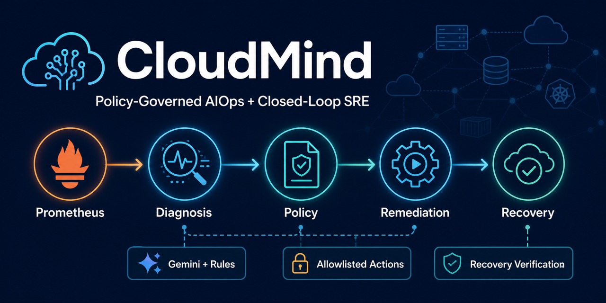
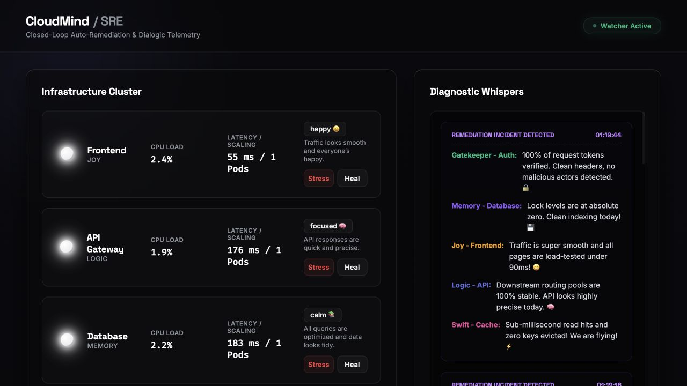
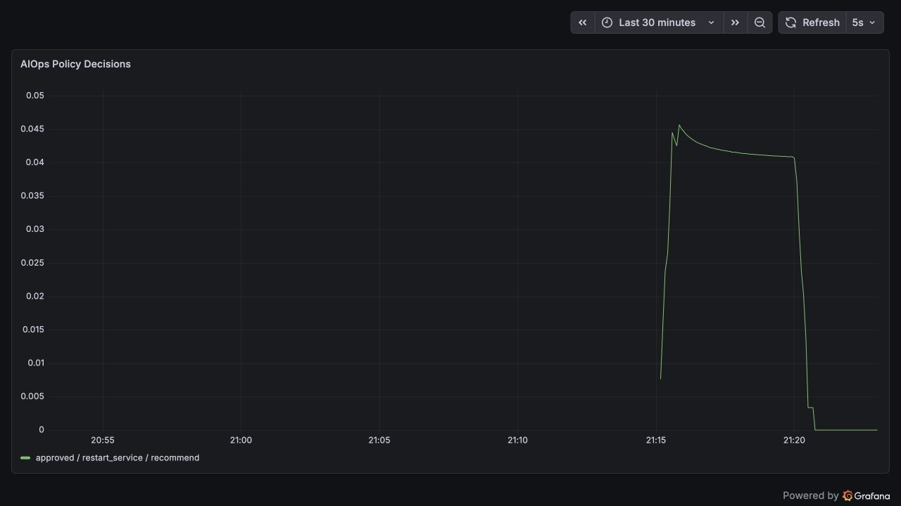

  

<h1 align="center">CloudMind</h1>

  <strong>AIOps-Enabled Closed-Loop SRE Platform</strong>

  Prometheus telemetry, dependency-aware diagnosis, grounded AI evidence, 
  deterministic remediation policy, and post-action recovery verification.

  
  
  
  
  
  

  <a href="#architecture">Architecture</a> •
  <a href="#verified-engineering-evidence">Verified evidence</a> •
  <a href="#run-it-locally">Run locally</a> •
  <a href="docs/demo-guide.md">Demo guide</a> •
  <a href="docs/safety-model.md">Safety model</a>

---

## The 30-Second Tour

CloudMind is a controlled AIOps laboratory built around five Dockerized Flask services. It observes the system, correlates service and dependency signals, proposes a bounded response, and records every decision.

| 1 · Observe | 2 · Diagnose | 3 · Govern | 4 · Verify |
|---|---|---|---|
| Prometheus captures service and dependency health. | Gemini structured output or deterministic rules identify the probable cause. | Grounded evidence, allowlists, cooldowns, budgets, and circuit breakers decide what is safe. | Prometheus and active probes determine whether the service recovered. |

> **The LLM never controls Docker.** It provides advisory diagnosis only. Local deterministic policy owns every execution decision.

## See It Running

<table>
  <tr>
    <td width="50%" valign="top">
      
       <strong>Operator view</strong> 
      Live service health, controlled stress actions, incident dialogue, and persisted AIOps decisions.
    </td>
    <td width="50%" valign="top">
      
       <strong>Policy observability</strong> 
      Live InfraMirror policy-decision metrics rendered through Prometheus and Grafana.
    </td>
  </tr>
</table>

The screenshots above are authentic captures from the local Docker Compose runtime. See the [live recommend-mode validation record](docs/live-validation-results.md).

## Architecture

~~~mermaid
flowchart TB
    subgraph OBSERVE["1 · OBSERVE"]
        direction LR
        S["Five Flask services"] --> P["Prometheus"]
        P --> A["Alertmanager"]
    end

    subgraph UNDERSTAND["2 · UNDERSTAND"]
        direction LR
        A --> I["InfraMirror snapshot"]
        I --> D["Gemini schema or rules fallback"]
        D --> G["Evidence grounding"]
    end

    subgraph GOVERN["3 · GOVERN"]
        direction LR
        G --> E["Deterministic evidence score"]
        E --> Q{"Policy decision"}
        Q -->|Recommend| AUDIT["Persist for operator"]
        Q -->|Execute| GUARDS["Grace · cooldown · lease budget · circuit breaker"]
    end

    subgraph RECOVER["4 · ACT AND VERIFY"]
        direction LR
        GUARDS --> R["Allowlisted restart"]
        R --> V["Recovery verification"]
        V --> AUDIT
        AUDIT --> O["Dashboard · Grafana · audit trail"]
    end
~~~

| Layer | Responsibility | Trust boundary |
|---|---|---|
| Services | Produce workload, health, error, latency, and dependency signals | Never receive model-generated commands |
| Prometheus + Alertmanager | Observe and route authenticated alerts | Telemetry is treated as bounded input |
| InfraMirror diagnosis | Correlate the snapshot and propose a structured cause | Gemini is optional and advisory |
| Evidence grounding | Replace model numeric claims with snapshot truth | Ungrounded evidence cannot approve execution |
| Policy + guards | Score evidence and enforce allowlists, leases, budgets, and circuits | Sole authority for remediation |
| Recovery + audit | Probe health and persist the complete decision | No recovery claim without observed evidence |

Read [docs/architecture.md](docs/architecture.md) for the component map, data contracts, and Docker trust boundary.

## Why This Is AIOps

| Capability | CloudMind implementation |
|---|---|
| Telemetry correlation | CPU, latency, request rate, error ratio, availability, alerts, incidents, and dependency health |
| Root-cause analysis | Dependency-aware diagnosis across API, database, cache, auth, and frontend |
| AI-assisted operations | Schema-constrained Gemini diagnosis with deterministic fallback |
| Evidence integrity | Model-selected signals are resolved against the immutable telemetry snapshot |
| Governed action | Model confidence is separated from the deterministic policy evidence score |
| Closed-loop verification | Recovery requires Prometheus health plus active dependency probes |
| Operational auditability | Diagnosis, evidence, decision, execution, guard state, and recovery are persisted |

CloudMind does **not** claim learned anomaly detection, formal causal inference, self-learning, or autonomous production operations.

## Safety by Design

~~~text
recommend mode by default
        +
allowlisted action and target
        +
grounded target-consistent evidence
        +
deterministic evidence score
        +
startup grace + cooldown + per-target lease
        +
restart budget + recovery circuit breaker
        =
one governed remediation decision
~~~

- Safe defaults are <code>AIOPS_EXECUTION_MODE=recommend</code> and <code>HEALING_ENABLED=false</code>.
- Execute mode requires both <code>AIOPS_EXECUTION_MODE=execute</code> and <code>HEALING_ENABLED=true</code>.
- The only supported actions are <code>restart_service</code> and <code>no_action</code>.
- Only <code>frontend</code>, <code>api</code>, <code>database</code>, <code>cache</code>, and <code>auth</code> can be targeted.
- A single weak signal cannot authorize a restart.
- Gemini keys are sent in the <code>x-goog-api-key</code> header, never in a URL.
- Per-target restart budgets and circuit breakers prevent remediation loops.
- Docker socket access is privileged; CloudMind is intended for an operator-owned local environment.

Read the full [safety model](docs/safety-model.md) and [security policy](SECURITY.md).

## Verified Engineering Evidence

| Evidence | Verified result |
|---|---:|
| Automated tests | **224 passed** |
| Safety-critical branch coverage | **80.17%** |
| Deterministic validation scenarios | **10** |
| Fixture root-cause accuracy | **100%** |
| Fixture recommendation accuracy | **100%** |
| Transient no-action accuracy | **100%** |
| Unsafe actions executed | **0** |
| Live recommend-mode scenarios | **5 passed** |
| Prometheus scrape targets | **6 up** |
| Live Gemini requests used for validation | **0** |
| External API cost | **$0** |

Accuracy percentages describe deterministic fixtures—not production accuracy or provider reliability. Execute-mode recovery rate and MTTR remain unmeasured.

- Machine-readable evidence: [artifacts/aiops-validation-results.json](artifacts/aiops-validation-results.json)
- Generated report: [docs/validation-results.md](docs/validation-results.md)
- Live recommend-mode record: [docs/live-validation-results.md](docs/live-validation-results.md)
- Full hardening report: [CLOUDMIND_AIOPS_HARDENING_REPORT.md](CLOUDMIND_AIOPS_HARDENING_REPORT.md)

## Incident Lifecycle

1. A service exposes operational and dependency telemetry.
2. Prometheus evaluates the signals and Alertmanager sends an authenticated event.
3. InfraMirror captures a bounded snapshot and deterministic incident fingerprint.
4. Gemini returns schema-constrained advice, or rules produce a deterministic fallback.
5. Evidence grounding rejects invented signals and replaces numeric claims with observed values.
6. Policy computes an evidence score independent of model confidence.
7. Recommend mode records the decision without changing a container.
8. Execute mode rechecks grace, cooldown, lease, restart budget, and circuit state.
9. One allowlisted restart may occur, followed by recovery verification.
10. The complete trail is persisted and exported as bounded-label metrics.

## Run It Locally

### Prerequisites

- Docker Desktop with Docker Compose
- Python 3.12+

~~~bash
git clone https://github.com/Mukeshkr-19/CLOUDMIND.git
cd CLOUDMIND
cp .env.example .env
~~~

Set unique local values for <code>WHISPER_TOKEN</code> and <code>GRAFANA_ADMIN_PASSWORD</code>. Gemini and Discord are optional; leave <code>GEMINI_API_KEY</code> and <code>DISCORD_WEBHOOK_URL</code> blank to use deterministic/local fallbacks.

~~~bash
docker compose config --quiet
docker compose up -d --build
docker compose ps
~~~

| Open | Local URL |
|---|---|
| CloudMind operator dashboard | <http://127.0.0.1:5050> |
| InfraMirror metrics | <http://127.0.0.1:5055/metrics> |
| Prometheus | <http://127.0.0.1:9090> |
| Alertmanager | <http://127.0.0.1:9093> |
| Grafana | <http://127.0.0.1:3000> |

Stop the environment with <code>docker compose down</code>.

## Reproduce the Evidence

~~~bash
make dev-setup
make verify
make lint
make type-check
make coverage
make validation-report
~~~

Run the controlled live scenarios in safe recommend mode:

~~~bash
venv/bin/python scripts/run_aiops_scenarios.py all \
  --expect-mode recommend \
  --requests 10 \
  --incident-timeout 30
~~~

No Gemini request or container restart is required. See the [demo guide](docs/demo-guide.md) before enabling any execute-mode behavior.

## Configuration

| Variable | Safe default | Purpose |
|---|---|---|
| <code>GEMINI_API_KEY</code> | blank | Optional provider key |
| <code>GEMINI_MODEL</code> | <code>gemini-3.6-flash</code> | Configurable diagnosis model |
| <code>GEMINI_API_VERSION</code> | <code>v1beta</code> | Centralized REST API version |
| <code>AIOPS_EXECUTION_MODE</code> | <code>recommend</code> | Records decisions without execution |
| <code>HEALING_ENABLED</code> | <code>false</code> | Second explicit gate for container changes |
| <code>AIOPS_CONFIDENCE_THRESHOLD</code> | <code>0.75</code> | Advisory model-confidence floor |
| <code>AIOPS_EVIDENCE_SCORE_THRESHOLD</code> | <code>0.55</code> | Deterministic evidence floor |
| <code>AIOPS_MAX_RESTARTS_PER_SERVICE_PER_HOUR</code> | <code>3</code> | Rolling per-target restart budget |
| <code>AIOPS_MAX_FAILED_RECOVERIES</code> | <code>2</code> | Failed recoveries before circuit opening |
| <code>AIOPS_CIRCUIT_BREAKER_RESET_SEC</code> | <code>900</code> | Automatic circuit reset interval |
| <code>AIOPS_EXECUTION_GRACE_SEC</code> | <code>30</code> | Startup period forced to recommend mode |

See [.env.example](.env.example) for all bounded tuning options.

## Repository Map

| Path | Role |
|---|---|
| <code>microservices/</code> | Five Flask services and operational signals |
| <code>inframirror/gemini_client.py</code> | Secure structured-output client and retry boundary |
| <code>inframirror/incident_intelligence.py</code> | Provider diagnosis and dependency-aware rules |
| <code>inframirror/evidence_grounding.py</code> | Snapshot-backed evidence authority |
| <code>inframirror/policy_engine.py</code> | Deterministic policy evidence assessment |
| <code>inframirror/remediation_guard.py</code> | Restart budgets and circuit breakers |
| <code>inframirror/recovery_verifier.py</code> | Post-action health verification |
| <code>inframirror/incident_store.py</code> | Atomic bounded incident audit store |
| <code>inframirror/aiops_metrics.py</code> | Bounded-label AIOps Prometheus metrics |
| <code>scripts/</code> | Live scenarios and deterministic validation matrix |
| <code>grafana/provisioning/</code> | Service and AIOps dashboards |
| <code>.github/workflows/</code> | SHA-pinned CI, security, and CodeQL |

## Honest Scope

CloudMind is a portfolio and educational system for controlled local environments—not a production orchestrator.

- No learned anomaly-detection model or online learning.
- No formal causal-inference engine.
- No Kubernetes remediation implementation.
- Docker socket access has host-level security implications.
- Gemini output and availability can vary; deterministic rules remain available.
- Safety-module coverage is 80.17%, below the 85% stretch goal.
- Execute-mode recovery measurements and an edited end-to-end video remain future work.

## Roadmap

- Raise safety-module branch coverage above 85% with meaningful failure-path tests.
- Publish isolated execute-mode recovery measurements.
- Replace direct Docker socket access with a narrower remediation adapter.
- Add an edited end-to-end demonstration.

## Project Story

CloudMind gives infrastructure components distinct voices so an incident can be followed like a conversation. That personality layer makes the demo memorable, while telemetry, evidence grounding, policy, execution guards, and recovery verification remain deterministic and auditable.

## License

CloudMind is available under the [MIT License](LICENSE).
