# CloudMind

**AIOps-Enabled Closed-Loop SRE Platform**

Policy-governed incident intelligence that correlates Prometheus telemetry, alerts, and service dependencies to produce structured root-cause diagnoses, safe remediation decisions, and post-action recovery verification across five Dockerized Flask services.

[](https://github.com/Mukeshkr-19/CLOUDMIND/actions/workflows/ci.yml)
[](https://github.com/Mukeshkr-19/CLOUDMIND/actions/workflows/security.yml)
[](https://github.com/Mukeshkr-19/CLOUDMIND/actions/workflows/codeql.yml)
[](https://www.python.org/)
[](LICENSE)


## Project Overview

CloudMind is a controlled local AIOps and SRE laboratory. Five Flask services expose health and workload telemetry. Prometheus and Alertmanager detect operational problems; InfraMirror correlates the snapshot, produces a structured diagnosis through Gemini or deterministic rules, grounds every model-selected signal against collected telemetry, and passes the result to deterministic safety policy.

The model never controls Docker. Recommend mode is the default. Execute mode requires explicit operator configuration and still must pass allowlists, evidence scoring, cooldown, startup grace, per-target lease, restart budget, circuit breaker, and recovery checks.

## Why CloudMind Is AIOps-Enabled

- Correlates service telemetry, active alerts, and API dependency health rather than reacting to one threshold in isolation.
- Uses a strict structured-output schema for optional Gemini diagnosis, with deterministic rules fallback when the provider is absent or unavailable.
- Lets the model select relevant signal names while local code replaces numeric values with the immutable Prometheus snapshot.
- Separates advisory `model_confidence` from a documented deterministic `policy_evidence_score`.
- Governs all remediation through local action and target allowlists; the only actions are `restart_service` and `no_action`.
- Verifies recovery with Prometheus health, latency, CPU, dependency state, and active API probes.
- Persists the diagnosis, grounded evidence, policy decision, execution, budget/circuit state, and recovery outcome.

CloudMind does **not** claim learned anomaly detection, formal causal inference, self-learning, or autonomous production operations.

## Architecture

```mermaid
flowchart LR
    S["Five Flask services"] --> P["Prometheus"]
    P --> A["Alertmanager"]
    A --> W["InfraMirror"]
    W --> T["Immutable telemetry snapshot"]
    T --> D["Gemini structured diagnosis or rules"]
    D --> G["Evidence grounding"]
    G --> E["Deterministic evidence score"]
    E --> Q{"Policy approved?"}
    Q -->|Recommend| I["Persist incident for operator"]
    Q -->|Execute + all guards pass| R["Allowlisted Docker restart"]
    R --> V["Recovery verification"]
    V --> I
    I --> O["Dashboard and AIOps metrics"]
```



See [architecture.md](docs/architecture.md) for component and trust-boundary details.

## End-to-End Incident Lifecycle

1. Prometheus records CPU, latency, requests, errors, availability, incident state, and dependency signals.
2. Alertmanager sends an authenticated event to InfraMirror.
3. InfraMirror captures a bounded telemetry snapshot and deterministic incident fingerprint.
4. Gemini returns schema-constrained advisory output, or rules provide a deterministic fallback.
5. `evidence_grounding.py` rejects unknown services/signals and replaces model numeric values with snapshot truth.
6. `policy_engine.py` computes a bounded evidence score independent of model confidence.
7. In recommend mode, the decision is recorded without a container change.
8. In execute mode, cooldown, lease, restart budget, and circuit breaker are rechecked atomically.
9. InfraMirror performs one allowlisted restart and verifies recovery.
10. The complete decision trail is stored and exposed through the dashboard and Prometheus metrics.

## Safety Boundary

- `AIOPS_EXECUTION_MODE=recommend` and `HEALING_ENABLED=false` are safe defaults.
- Execute mode requires both `AIOPS_EXECUTION_MODE=execute` and `HEALING_ENABLED=true`.
- Only `frontend`, `api`, `database`, `cache`, and `auth` may be targeted.
- The LLM cannot introduce commands, URLs, Docker arguments, arbitrary actions, or services.
- A restart needs grounded, target-consistent evidence and a deterministic score of at least `0.55` by default.
- A single weak signal cannot authorize a restart; direct unavailability or a correlated dependency failure is strong evidence.
- Per-target cooldowns, leases, hourly budgets, and recovery-based circuit breakers prevent restart loops.
- Docker socket access is highly privileged. Run CloudMind only in an operator-owned isolated environment.
- CloudMind is a portfolio and educational system, not a production orchestrator.

Read the detailed [safety model](docs/safety-model.md) and [security policy](SECURITY.md).

## Verified Results

The current deterministic zero-cost matrix is generated from executable fixtures, not manually typed:

| Metric | Verified result |
|---|---:|
| Automated tests | 224 passed |
| Safety-module branch coverage | 80.17% |
| Deterministic scenarios | 10 |
| Fixture root-cause accuracy | 100% |
| Fixture recommendation accuracy | 100% |
| Unsafe actions executed | 0 |
| Live Gemini requests | 0 |
| Live recovery success rate | Not measured in this run |

These figures describe deterministic fixtures only. They are not production accuracy, provider accuracy, availability, or MTTR claims. The generated source of truth is [aiops-validation-results.json](artifacts/aiops-validation-results.json); the readable report is [validation-results.md](docs/validation-results.md).

## Screenshots


Authentic capture of the running operator dashboard with service health, chaos controls, watcher state, and incident console.


Authentic capture of the provisioned Grafana policy-decision panel backed by the live InfraMirror metrics endpoint. The [live recommend-mode validation record](docs/live-validation-results.md) documents the five controlled runtime scenarios behind this evidence.

## Quick Start

### Prerequisites

- Docker Desktop with Docker Compose
- Python 3.12+

```bash
git clone https://github.com/Mukeshkr-19/CLOUDMIND.git
cd CLOUDMIND
cp .env.example .env
```

Set unique local values for `WHISPER_TOKEN` and `GRAFANA_ADMIN_PASSWORD` in `.env`. `GEMINI_API_KEY` and `DISCORD_WEBHOOK_URL` may stay blank; deterministic rules and local dialogue fallbacks remain available.

```bash
docker compose up -d --build
```

| Interface | URL |
|---|---|
| Operator dashboard | <http://127.0.0.1:5050> |
| InfraMirror metrics/webhook | <http://127.0.0.1:5055> |
| Prometheus | <http://127.0.0.1:9090> |
| Alertmanager | <http://127.0.0.1:9093> |
| Grafana | <http://127.0.0.1:3000> |

Stop the local stack with `docker compose down`.

## Configuration Reference

| Variable | Default | Purpose |
|---|---|---|
| `GEMINI_API_KEY` | blank | Optional provider key; sent only in `x-goog-api-key` header |
| `GEMINI_MODEL` | `gemini-3.6-flash` | Configurable stable Gemini model verified against official docs on 2026-07-30 |
| `GEMINI_API_VERSION` | `v1beta` | Centralized REST API version |
| `AIOPS_EXECUTION_MODE` | `recommend` | `recommend` or explicitly enabled `execute` |
| `AIOPS_CONFIDENCE_THRESHOLD` | `0.75` | Advisory model-confidence floor |
| `AIOPS_EVIDENCE_SCORE_THRESHOLD` | `0.55` | Deterministic policy evidence floor |
| `AIOPS_MAX_RESTARTS_PER_SERVICE_PER_HOUR` | `3` | Per-service rolling restart budget |
| `AIOPS_MAX_FAILED_RECOVERIES` | `2` | Opens the circuit breaker after repeated failure |
| `AIOPS_CIRCUIT_BREAKER_RESET_SEC` | `900` | Automatic circuit reset interval |
| `HEALING_COOLDOWN_SEC` | `150` | Per-target cooldown |
| `AIOPS_EXECUTION_GRACE_SEC` | `30` | Startup window forced to recommend mode |

See [.env.example](.env.example) for the complete bounded configuration.

## Testing

```bash
make dev-setup
make verify
make lint
make type-check
make coverage
make validation-report
```

`make verify` compiles sources, runs the full unit suite, and validates Compose. The coverage gate targets the safety-critical diagnosis, grounding, policy, store, guard, and recovery modules. The existing broad InfraMirror baseline remains lower because the legacy watcher is not yet comprehensively branch-tested.

Live local scenarios are operator actions:

```bash
python3 scripts/run_aiops_scenarios.py all --expect-mode recommend
```

No live Gemini call is required. See [demo-guide.md](docs/demo-guide.md).

## Repository Structure

| Path | Purpose |
|---|---|
| `microservices/` | Five Flask services and operational signals |
| `inframirror/gemini_client.py` | Header authentication, structured output, retry/error boundaries |
| `inframirror/incident_intelligence.py` | Gemini diagnosis and rules fallback |
| `inframirror/evidence_grounding.py` | Snapshot-backed evidence authority |
| `inframirror/policy_engine.py` | Deterministic evidence assessment and policy |
| `inframirror/remediation_guard.py` | Restart budgets and circuit breakers |
| `inframirror/recovery_verifier.py` | Post-action health verification |
| `inframirror/incident_store.py` | Bounded atomic audit persistence and corrupt-file preservation |
| `inframirror/aiops_metrics.py` | Bounded-label InfraMirror Prometheus metrics |
| `scripts/run_aiops_scenarios.py` | Live local scenarios and deterministic report entry point |
| `scripts/aiops_validation.py` | Zero-cost ten-scenario fixture matrix |
| `grafana/provisioning/` | Service and AIOps dashboard provisioning |
| `.github/workflows/` | SHA-pinned CI, security, and CodeQL workflows |

## Security Considerations

Gemini credentials are never placed in URLs or logged. Provider errors are reduced to bounded categories, error bodies are not persisted, only retryable status codes receive bounded retries, and deterministic rules remain available after failure. Alertmanager and InfraMirror use an authenticated webhook. Workflow actions are pinned to full upstream commit SHAs.

The Docker socket remains the largest trust boundary. Treat the InfraMirror container as host-privileged and never expose it directly to untrusted networks.

## Known Limitations

- No learned anomaly-detection model or online learning.
- No formal causal-inference engine; diagnosis is dependency-aware and heuristic.
- Local Docker Compose scope; Kubernetes remediation is not implemented.
- Docker socket access has host-level security implications.
- Gemini output and provider availability can vary; rules fallback is deterministic.
- The 80.17% safety-module coverage gate is below the 85% stretch goal.
- Current committed accuracy percentages are deterministic fixture evidence; execute-mode recovery measurements remain pending.
- An edited end-to-end demo recording remains pending; authentic operator and Grafana screenshots are committed.

## Roadmap

- Raise branch coverage above 85% for incident intelligence, policy, store, and recovery paths.
- Publish operator-run execute-mode recovery measurements and an edited end-to-end demo.
- Replace host Docker access with a narrower remediation adapter before considering broader deployment.
- Evaluate a Kubernetes adapter only as a separate, explicitly governed implementation.

## License

CloudMind is available under the [MIT License](LICENSE).

## Inspiration and Project Personality

CloudMind gives infrastructure components distinct voices to make incidents easier to follow during a demo. That presentation layer is deliberately separate from the safety path: telemetry, evidence grounding, policy, execution guards, and recovery verification stay deterministic and auditable.
