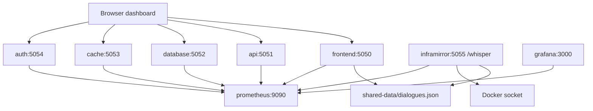

# CloudMind

CloudMind is a local Docker demo that turns microservice telemetry into character-driven incident dialogue. Five Flask services expose health, load, incident, stress, heal, and Prometheus metrics endpoints. Prometheus watches them, Grafana is provisioned for dashboards/alerting, and the InfraMirror watcher generates dialogue plus optional container restarts.

This is an SRE/observability portfolio project, not a production platform. The remediation is intentionally local and demo-oriented: InfraMirror mounts the Docker socket so it can restart CloudMind containers when `HEALING_ENABLED=true`.

## Architecture



## Services

| Service | Port | Persona | Main endpoints |
| --- | ---: | --- | --- |
| `frontend` | `5050` | Joy | `/`, `/status`, `/load`, `/incident`, `/stress`, `/heal`, `/metrics`, `/dialogues` |
| `api` | `5051` | Logic | `/status`, `/load`, `/incident`, `/stress`, `/heal`, `/metrics` |
| `database` | `5052` | Memory | `/status`, `/load`, `/incident`, `/stress`, `/heal`, `/metrics` |
| `cache` | `5053` | Swift | `/status`, `/load`, `/incident`, `/stress`, `/heal`, `/metrics` |
| `auth` | `5054` | Gatekeeper | `/status`, `/load`, `/incident`, `/stress`, `/heal`, `/metrics` |
| `inframirror` | `5055` | SRE watcher | `/whisper` |
| `prometheus` | `9090` | Metrics store | Prometheus UI |
| `grafana` | `3000` | Dashboard | `admin` / `admin` |

## Quick Start

Start Docker Desktop first, then run:

```bash
./run_demo.sh
```

Open:

- Dashboard: http://localhost:5050
- Prometheus: http://localhost:9090
- Grafana: http://localhost:3000
- InfraMirror webhook: http://localhost:5055/whisper

To stop the demo:

```bash
docker compose down
```

If your machine only has the legacy Compose binary, use `docker-compose down`.

## Local Tests

Create a virtual environment and run the unit suite:

```bash
python3 -m venv venv
venv/bin/pip install -r requirements.txt
venv/bin/python -m unittest discover -s tests
python3 -m compileall microservices inframirror tests
docker compose config --quiet
```

The tests cover the five Flask services and the dialogue engine fallback path. Docker smoke testing is still separate because it needs Docker Desktop and local ports.

## Manual Smoke Checks

After `./run_demo.sh`:

```bash
curl http://localhost:5050/status
curl http://localhost:5051/load
curl http://localhost:5052/incident
curl -X POST http://localhost:5055/whisper \
  -H 'Content-Type: application/json' \
  -d '{"service":"database","cpu":91.2,"latency":401}'
```

The `/whisper` endpoint returns `202 Accepted` quickly and performs dialogue generation plus healing in a background thread.

## Optional AI and Discord

CloudMind works without external credentials by using local fallback dialogue scripts.

To enable Gemini-generated dialogue or Discord embeds:

```bash
cp .env.example .env
```

Then edit `.env`:

```bash
GEMINI_API_KEY=your_gemini_key
DISCORD_WEBHOOK_URL=your_discord_webhook
```

Keep `.env` local. Do not commit real secrets.

## Files

- `microservices/*/service.py`: Flask services and Prometheus metrics.
- `inframirror/watcher.py`: Prometheus polling, `/whisper`, cooldown logic, and Docker restart behavior.
- `inframirror/llm_engine.py`: Gemini prompt orchestration, local fallbacks, dialogue persistence, and Discord embed formatting.
- `prometheus/prometheus.yml`: scrape config.
- `prometheus/alerts.yml`: alert rules.
- `grafana/provisioning/`: provisioned Grafana datasource, dashboards, and alerts.
- `tests/`: unit tests.
- `run_demo.sh`: one-command local launcher.
- `chaos.sh`: interactive stress/heal script.

## Security Notes

- `inframirror` mounts `/var/run/docker.sock`, which is powerful. Use this only in a local demo environment.
- Compose reads `GEMINI_API_KEY` and `DISCORD_WEBHOOK_URL` from your shell or `.env`; keep real values out of Git.
- If credentials are exposed, rotate them immediately and rebuild the stack.
