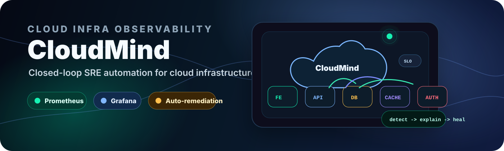
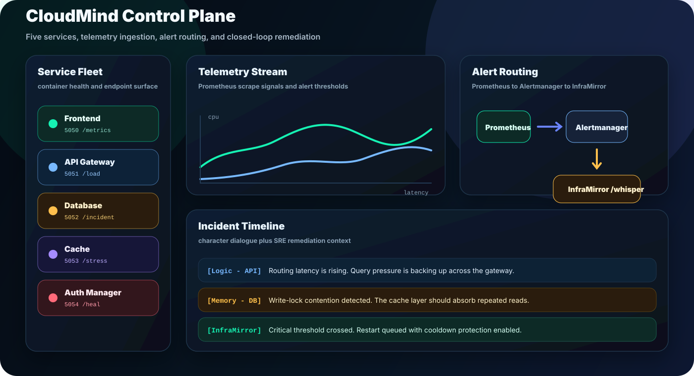
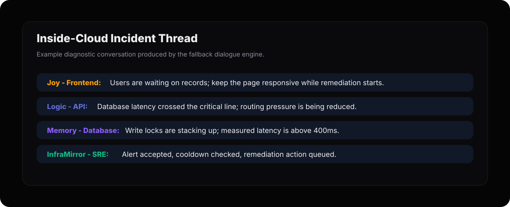
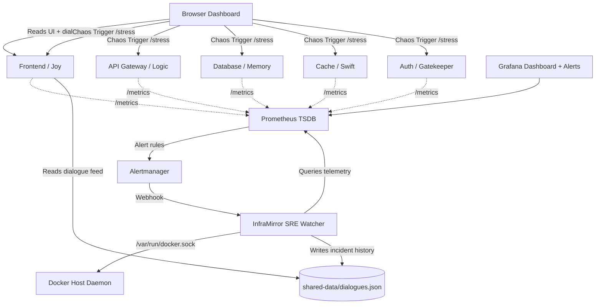

# 🧠 CloudMind — Inside the Cloud

> **"What if your cloud infrastructure could talk in character while it diagnoses and heals itself?"**

[](https://github.com/Mukeshkr-19/CLOUDMIND/actions/workflows/ci.yml)
[](https://github.com/Mukeshkr-19/CLOUDMIND/actions/workflows/security.yml)




CloudMind is a creative **Dialogic Telemetry & Closed-Loop SRE Auto-Remediation Platform** inspired by the movie *Inside Out*. Instead of staring at silent dashboards and dry alerts, CloudMind maps five microservices to distinct character voices that discuss outages in real time while an InfraMirror watcher monitors metrics and optionally restarts unhealthy containers.

CloudMind brings together **Docker orchestration, Flask microservices, Prometheus metrics, Grafana provisioning, webhook-driven incident handling, shared-volume state, and AI-assisted infrastructure storytelling** into one cohesive SRE observability system.

> **Note:** CloudMind is designed for controlled, operator-owned environments. Its auto-remediation intentionally mounts the Docker socket so the watcher can restart managed CloudMind containers.

---

## 🌟 Why CloudMind Is Different

CloudMind turns infrastructure behavior into a readable incident narrative:

- Engineers get Prometheus telemetry and Grafana panels.
- Operators get a clear incident trail instead of disconnected alert noise.
- Each service explains what is hurting from its own role in the system.
- InfraMirror can receive alert webhooks, generate context, and remediate unhealthy containers.
- The dashboard preserves incident history through shared-volume state.

That combination makes CloudMind a distinctive SRE observability platform with concrete Docker orchestration, metrics, alert routing, remediation control, and incident memory.

---

## ✅ Verified at a Glance

| Signal | Current Coverage |
| :--- | :--- |
| **Microservices** | `5` Flask services with `/status`, `/load`, `/incident`, `/stress`, `/heal`, and `/metrics` |
| **SRE Watcher** | InfraMirror webhook on `5055` with bearer/header authentication |
| **Alerting** | Prometheus rules for service availability, elevated CPU, critical CPU, and latency |
| **Remediation** | Docker-socket restart path with cooldown control and incident persistence |
| **Tests** | `14` unit tests covering service endpoints, watcher decisions, webhook auth, and fallback dialogue |
| **CI Gates** | Python compile, unit tests, Compose validation, private-env guard, pip-audit, and Trivy scan |

---

## 🖼️ Visual Tour



The operator view combines service health, chaos controls, active telemetry, and incident dialogue in one place.



Incident threads show the affected service, peer-service context, and the InfraMirror SRE action line.

---

## 🎭 The Infrastructure Emotion Matrix

| Microservice | Port | Persona | Character Voice | Behavior Profile |
| :--- | :---: | :---: | :--- | :--- |
| **🖥️ Frontend** | `5050` | Joy 😄 | Positive & energetic | Protects the user experience and hates slow pages. |
| **🧠 API Gateway** | `5051` | Logic 🧠 | Technical & impatient | Routes traffic, watches latency, and blames bottlenecks precisely. |
| **📚 Database** | `5052` | Memory 📚 | Cautious & nervous | Panics under lock contention, indexing load, and slow writes. |
| **⚡ Cache** | `5053` | Swift ⚡ | Hyper-active & fast | Loves cache hits and gets stressed by evictions or misses. |
| **🔒 Auth Manager** | `5054` | Gatekeeper 🔒 | Snarky & security-minded | Verifies tokens and gets paranoid under suspicious traffic. |
| **🛡️ InfraMirror** | `5055` | SRE Watcher | Calm remediation engine | Receives `/whisper` alerts, writes dialogues, and restarts containers. |

---

## 🛠️ System Architecture

CloudMind runs as an orchestrated multi-container cluster inside a Docker network:



1. **Core Microservices (`microservices/`)**: Five lightweight Flask services expose `/status`, `/load`, `/incident`, `/stress`, `/heal`, and `/metrics`.
2. **Telemetry Layer (`prometheus/`)**: Prometheus scrapes every service and exposes queryable health signals.
3. **Alert Routing (`alertmanager/`)**: Alertmanager receives Prometheus rule events and routes them into InfraMirror's `/whisper` webhook.
4. **SRE AI Watcher (`inframirror/`)**: InfraMirror watches Prometheus, receives `/whisper` webhooks, generates character dialogue, and performs container remediation.
5. **Persistent Dialogue Feed**: Incident conversations are written to `shared-data/dialogues.json`, so the dashboard can display recent system conversations even after restarts.
6. **Dashboard Experience**: The Frontend at `http://127.0.0.1:5050` shows service health, stress controls, and the Inside-Cloud dialogue console.

---

## 🚀 SRE Core Concepts

### 1. Auto-Remediation vs. Horizontal Scaling

CloudMind shows the difference between scaling and healing:

- **Horizontal Scaling Simulation:** As CPU rises, the dashboard can show active replicas scaling from `1 Pod` toward `3 Pods`.
- **Auto-Remediation:** Prometheus marks elevated CPU at `70%` and critical CPU at `85%`; InfraMirror can generate an incident dialogue and restart the affected container when critical signals appear.

The pattern mirrors real SRE thinking: detect, explain, act, and preserve incident context.

### 2. State Persistence Across Restarts

Container memory disappears on restart, so CloudMind writes dialogue history into a shared Docker volume at `/app/shared/dialogues.json`. The Frontend reads from that volume, keeping the incident story visible after remediation.

### 3. AI-Optional Dialogue Engine

CloudMind works without external APIs by using built-in fallback dialogue scripts. If a Gemini key is provided, InfraMirror attempts live AI-generated dialogue and falls back safely if the call fails.

---

## ⚡ Quick Start

### Prerequisites

- Docker Desktop running.
- Python 3.x for tests.

### 1. Launch the Cluster

```bash
docker compose up -d --build
```

This rebuilds the services and starts the full CloudMind stack in the background.

### 2. Access the Interfaces

- **CloudMind Dashboard:** [http://127.0.0.1:5050](http://127.0.0.1:5050)
- **Prometheus Console:** [http://127.0.0.1:9090](http://127.0.0.1:9090)
- **Alertmanager Console:** [http://127.0.0.1:9093](http://127.0.0.1:9093)
- **Grafana Panel:** [http://127.0.0.1:3000](http://127.0.0.1:3000)
  Use `GRAFANA_ADMIN_USER` and `GRAFANA_ADMIN_PASSWORD` from your `.env`.
- **InfraMirror Webhook:** [http://127.0.0.1:5055/whisper](http://127.0.0.1:5055/whisper)

### 3. Stop the Cluster

```bash
docker compose down
```

If your machine only has legacy Compose:

```bash
docker-compose down
```

---

## 🧪 Injecting Chaos & Watching Recovery

### Option A: Use the Interactive Chaos Commander

```bash
./chaos.sh
```

Choose a service to stress, heal, or inspect through the menu.

### Option B: Trigger a Service Directly

```bash
curl -X POST http://127.0.0.1:5052/stress
```

Then watch:

1. CPU and latency rise for the target service.
2. Prometheus records the updated telemetry.
3. InfraMirror writes a 5-service dialogue plus an SRE remediation line.
4. The dashboard dialogue feed updates from the shared volume.
5. If healing is enabled, the affected container is restarted.

### Option C: Test the `/whisper` Webhook

```bash
curl -i -X POST http://127.0.0.1:5055/whisper \
  -H 'Content-Type: application/json' \
  -d '{"service":"database","cpu":91.2,"latency":401}'
```

Expected behavior: `/whisper` returns `202 Accepted` quickly, then dialogue generation and remediation continue in the background.

---

## ✅ Run the Test Suite

```bash
make verify
```

`make verify` creates the virtual environment when needed, installs dependencies, compiles Python modules, runs the unit tests, and validates the Docker Compose configuration.

GitHub Actions also runs Python compilation, unit tests, Docker Compose validation, and secret scanning on pushed branches and pull requests.

---

## 🤖 Activating Real AI Dialogue Generation

CloudMind runs without credentials. To enable Gemini-generated dialogue or Discord incident embeds:

```bash
cp .env.example .env
```

Then edit `.env`:

```bash
GEMINI_API_KEY=your_gemini_key
DISCORD_WEBHOOK_URL=your_discord_webhook
WHISPER_TOKEN=your_long_random_webhook_token
GRAFANA_ADMIN_USER=admin
GRAFANA_ADMIN_PASSWORD=change_this_grafana_password
```

Restart the stack:

```bash
docker compose up -d --build
```

Keep `.env` private. Never commit real secrets.

---

## 📁 Repository Map

| Path | Purpose |
| :--- | :--- |
| `microservices/*/service.py` | Flask microservice implementations and Prometheus metrics |
| `inframirror/watcher.py` | Prometheus watcher, `/whisper` webhook, cooldowns, and remediation |
| `inframirror/llm_engine.py` | Gemini prompt orchestration, fallback dialogue, persistence, Discord embeds |
| `prometheus/prometheus.yml` | Prometheus scrape configuration |
| `prometheus/alerts.yml` | Alert rule definitions |
| `alertmanager/alertmanager.yml` | Prometheus alert routing into InfraMirror |
| `grafana/provisioning/` | Provisioned Grafana dashboards, datasource, and alerting config |
| `docs/assets/` | README banner and interface preview assets |
| `tests/` | Unit tests for services and watcher dialogue behavior |
| `chaos.sh` | Interactive chaos and healing script |
| `SECURITY.md` | Secret handling, rotation, Docker socket, and webhook guidance |
| `LICENSE` | MIT license terms |

---

## 🏷️ Repository Topics

Suggested GitHub topics:

`docker`, `prometheus`, `grafana`, `sre`, `observability`, `flask`, `auto-remediation`, `devops`, `alertmanager`, `site-reliability-engineering`

---

## 🔐 Security Notes

- `inframirror` mounts `/var/run/docker.sock`; this is powerful and should be used only in controlled environments.
- `.env` is ignored by Git and should contain secrets only on your machine.
- If a token or API key is exposed, revoke and rotate it immediately.
- Override Grafana credentials in `.env` before running CloudMind in a shared environment.

See [SECURITY.md](SECURITY.md) for credential rotation and operational safeguards.

---

## 📜 License

CloudMind is released under the [MIT License](LICENSE).
