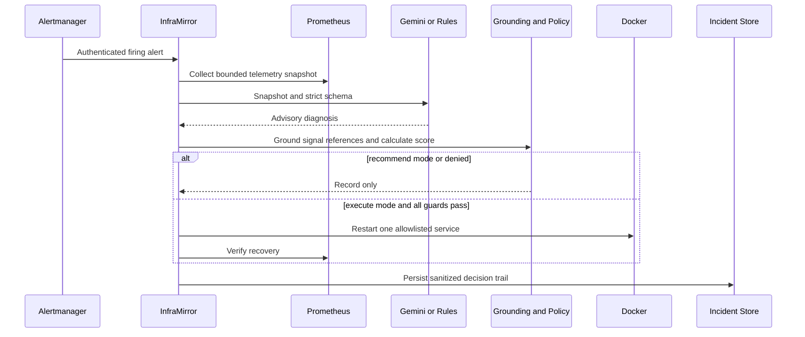

# Architecture

## Components

| Layer | Components | Responsibility |
|---|---|---|
| Workload | Five Flask microservices | Health, workload, stress/heal endpoints, Prometheus metrics |
| Observability | Prometheus, Alertmanager, Grafana | Collection, alerting, dashboards |
| Incident intake | InfraMirror `/whisper` | Authenticated, validated, bounded alert ingestion |
| Intelligence | Gemini client or deterministic rules | Advisory structured diagnosis |
| Trust enforcement | Evidence grounding and policy engine | Replace model values with telemetry truth and decide safely |
| Execution guards | Startup grace, cooldown, lease, budget, circuit breaker | Prevent concurrent, repeated, or looping remediation |
| Recovery | Recovery verifier | Prometheus and active dependency probes |
| Audit | Incident store and dashboard | Atomic bounded record of the complete decision |

## Data Flow

## Trust Boundaries

1. Alert payloads are untrusted and validated before work is queued.
2. Prometheus is the numeric source of truth for the captured snapshot.
3. Gemini output is untrusted advisory data even when schema-valid.
4. Deterministic Python owns all action, target, score, budget, and circuit decisions.
5. Docker socket access is host-privileged and limited to controlled local environments.
6. Persisted records are recursively redacted and bounded; provider error bodies are excluded.

## Failure Behavior

- Missing key/provider/library, timeout, authentication failure, rate limit, server failure, malformed output, empty output, or schema failure leads to rules fallback.
- Unknown or missing evidence is rejected; model numeric mismatches are replaced by snapshot values.
- Insufficient score, wrong target, risk, cooldown, budget, circuit, or lease state suppresses execution.
- Failed recovery increments the target circuit-breaker counter.
- A malformed incident file is preserved as a `.corrupt-*` backup before a new atomic store is written.
